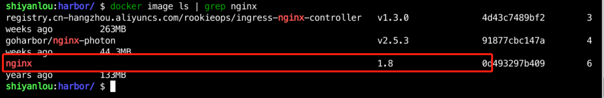

### Client operations

Now, we are going to try to Pull/Push the image to the Harbor repository. First we need to log into Harbor with the following command:

```bash
docker login http://10.111.127.141:30002
```

When we enter the username/password: `admin/Harbor12345`, we will find that we cannot log in, and the error will be as follows:


This is due to the fact that the default docker registry uses https, while the current Harbor uses http. We need to change the Docker configuration by using `sudo vim /etc/docker/daemon.json` and inserting the following in it:

```json
  "insecure-registries": ["http://10.111.127.141:30002"]
```

Modified as follows:


Then reload the docker configuration file with the following command:

```bash
sudo systemctl daemon-reload
sudo systemctl reload docker
```

> PS: If the login still fails with `sudo systemctl reload docker`, you need to restart Docker with `sudo systemctl restart docker`, which will cause the Kubernetes cluster to rebuild, which will take longer.

Now we can continue logging in using `docker login http://10.111.127.141:30002`, which works as follows:


#### pushing the image to the Harbor repository

Our local image of `nginx:1.8` now exists, as follows:


This Nginx is pulled from Dockerhub, so to push it to the private Harbor, we need to change the image name with the following command:

```bash
docker tag nginx:1.8 10.111.127.141:30002/dev/nginx:1.8
```

Then use the `docker push` command to push the image to Harbor with the following command:

```bash
docker push 10.111.127.141:30002/dev/nginx:1.8
```

The output is as follows:


The image pushed up can be viewed on Harbor as follows:


#### pulls mirrors

The prerequisite for pulling a mirror is also to be logged into Harbor, and since we are already logged in, we can pull it directly using the command here, as follows.

```bash
docker pull 10.111.127.141:30002/dev/nginx:1.8
```

This completes the basic operation of Harbor.
