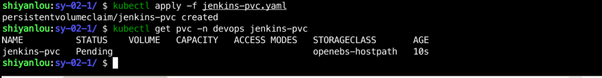

### Create a PVC to provide data persistence for Jenkins

Create a `jenkins-pvc.yaml` file in the `/home/shiyanlou/Code/devops/sy-02-1` directory and write the following:

```yaml
apiVersion: v1
kind: PersistentVolumeClaim
metadata.
  name: jenkins-pvc
  namespace: devops
spec.
  accessModes.
    - ReadWriteOnce
  storageClassName: openebs-hostpath
  resources.
    requests.
      storage: 5Gi
```

Then use `kubectl apply -f jenkins-pvc.yaml` to create the PVC and use `kubectl get pvc -n devops jenkins-pvc` to view the PVC status as follows:


