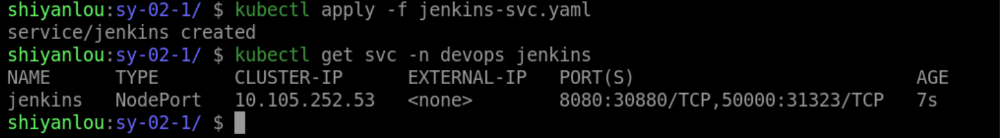

### Create Jenkins Service

Here we use NodePort to access Jenkins.

Create a `jenkins-svc.yaml` file in the `/home/shiyanlou/Code/devops/sy-02-1` directory and write the following:

```yaml
apiVersion: v1
kind: Service
metadata.
  name: jenkins
  namespace: devops
  labels.
    app: jenkins
spec.
  selector.
    app: jenkins
  type: NodePort
  ports.
    - name: web
      port: 8080
      targetPort: web
      nodePort: 30880
    - name: agent
      port: 50000
      targetPort: agent
```

Use `kubectl apply -f jenkins-svc.yaml` to create the Service and use `kubectl get svc -n devops jenkins` to view the Service status as follows:



The Jenkins deployment is now complete.
