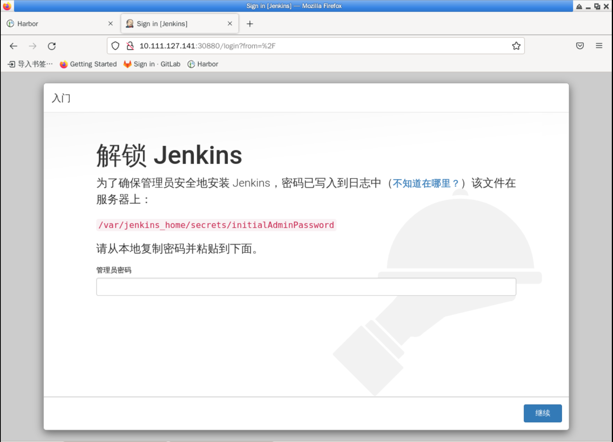
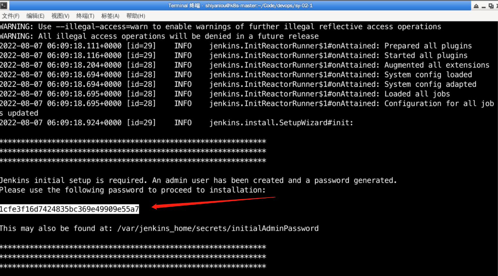
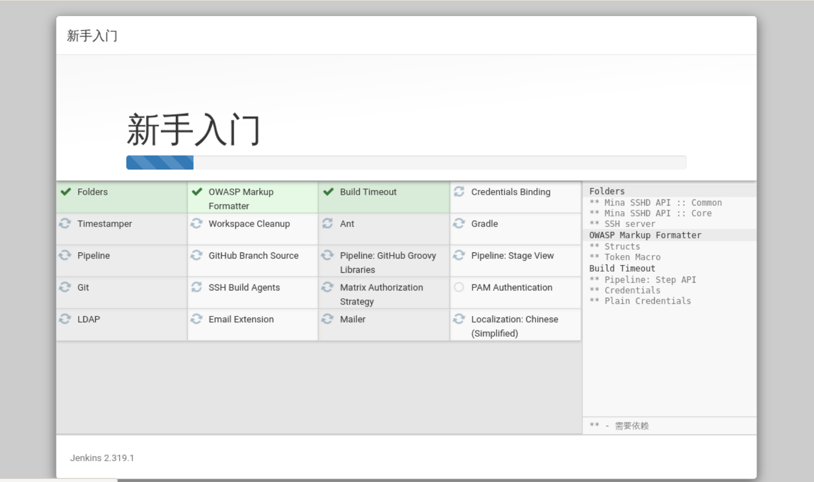
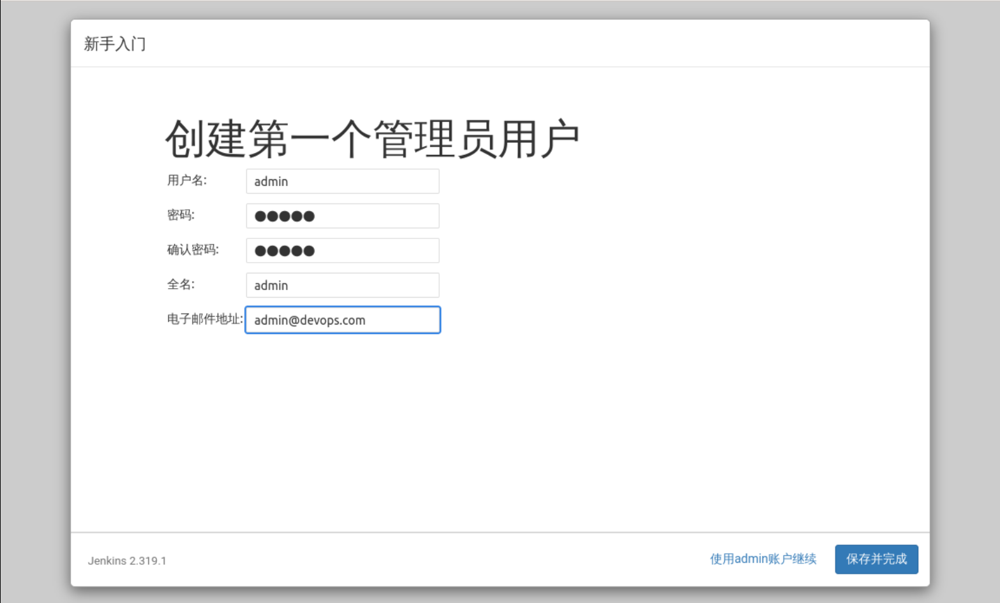
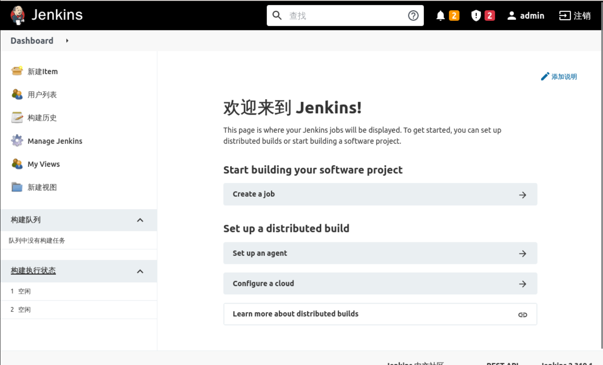

## Jenkins initialization

Since our Jenkins is exposed directly using Service NodePort, we can access it directly using `http://10.111.127.141:30880`, as follows:

To log in and get the admin key, you can directly use `kubectl logs -n devops [POD_NAME]` to see the key, as follows

Copy the key to your browser, fill it in and continue to the plugin installation screen, then select `Install recommended plugins`, as follows:

Then it will follow the default plugin and wait for the installation to complete, as follows:

Then create an administrator account, fill in the specific information, and click Save, as follows:

Configure the Jenkins address, the default is fine, as follows

Then click **Start Using Jenkins** to complete the initialization of Jenkins and enter the Jenkins interface, as follows

