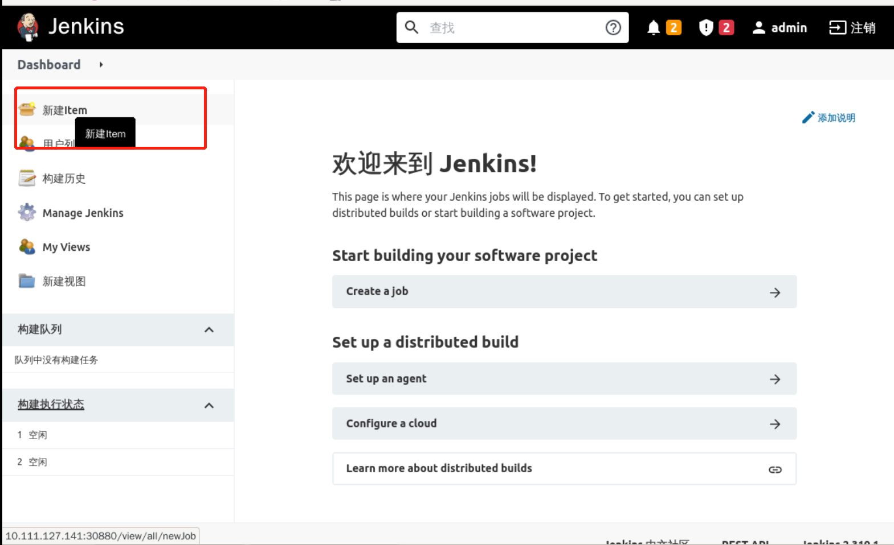
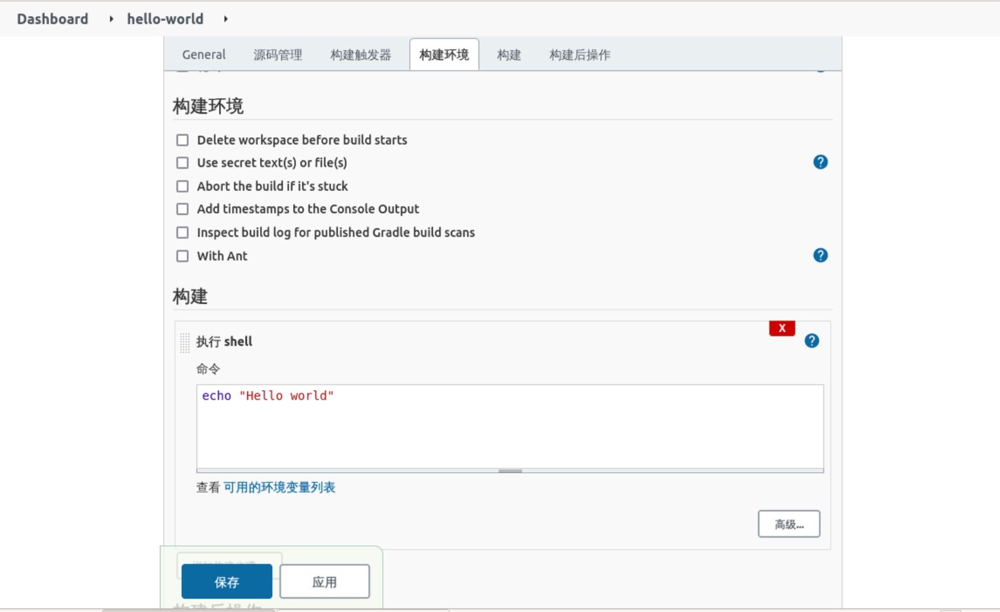
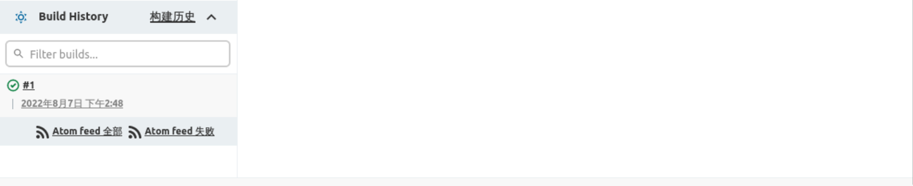

### Jenkins testing

Now, let's create a simple `free style` project to test that Jenkins is working properly.

First click **New item** to create a task.

Enter the task name and select the free style

Pull down to the bottom **Build**, select **Execute Shell** and type `echo 'Hello world'`, as follows:

Click Save and the first pipeline is created.

Click **Build Now** to execute the pipeline.

After clicking on the build, the build history is displayed as follows:

Select the build sequence and select **console output** to see the output log, as follows:

You can tell from the output that the pipeline build was successful, indicating that Jenkins is working properly.
