## Configure Slave

Previously, when deploying Jenkins on a physical machine, you would use a static Slave, i.e. configure jenkins-agent on a defined node, which had some problems, such as

- Each Slave has a different configuration environment to complete operations such as compilation and packaging in different languages, but these differing configurations make it very inconvenient to manage and laborious to maintain.
- Unbalanced resource allocation, some Slave to run the job appears to wait in line, while some Slave is idle.
- Resources are wasted, each Slave may be a physical machine or a virtual machine, and when the Slave is idle, the resources are not completely released.

For this reason, in Kubernetes, we use the dynamic Slave model, which creates Slave only when the pipeline is running, and dries up the Slave when the pipeline is finished, with the following logic diagram:

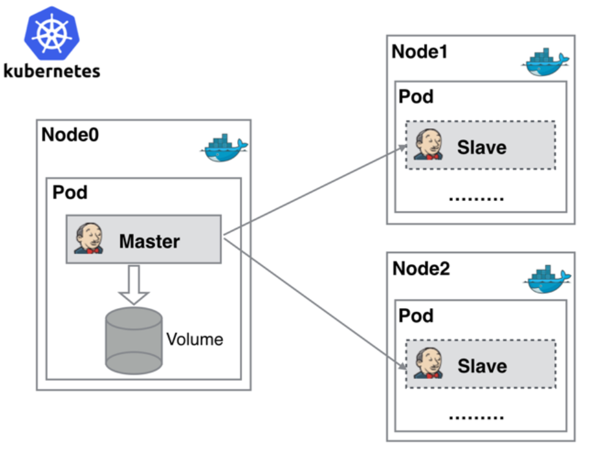

This approach has the following advantages:

- When the Jenkins Master fails, Kubernetes automatically creates a new Jenkins Master container and assigns the Volume to the newly created container, ensuring that no data is lost, thus achieving high availability of cluster services.
- Kubernetes dynamically assigns Slave to a free node based on the usage of each resource, reducing the risk of a node with high resource utilization. Kubernetes dynamically assigns slave creation to free nodes based on each resource usage, reducing the risk of waiting in queue for a node with high resource utilization.
- Scalability: When a Kubernetes cluster is severely under-resourced and a Job is queued, it is easy to add a Kubernetes Node to the cluster, thus enabling scaling.

#### Installing the kubernetes plugin

Select **System Administration** -> **Plugin Management** -> **Optional Plugins**, search for `kubernetes`, select the plugin and click Install, as follows:


Wait for its installation and reboot to complete.


#### Configuring the Kubernetes Plugin

Select **System Administration** -> **Node Administration** -> **Configure Clouds** and select `kubernetes` in Configure Cluster as follows:

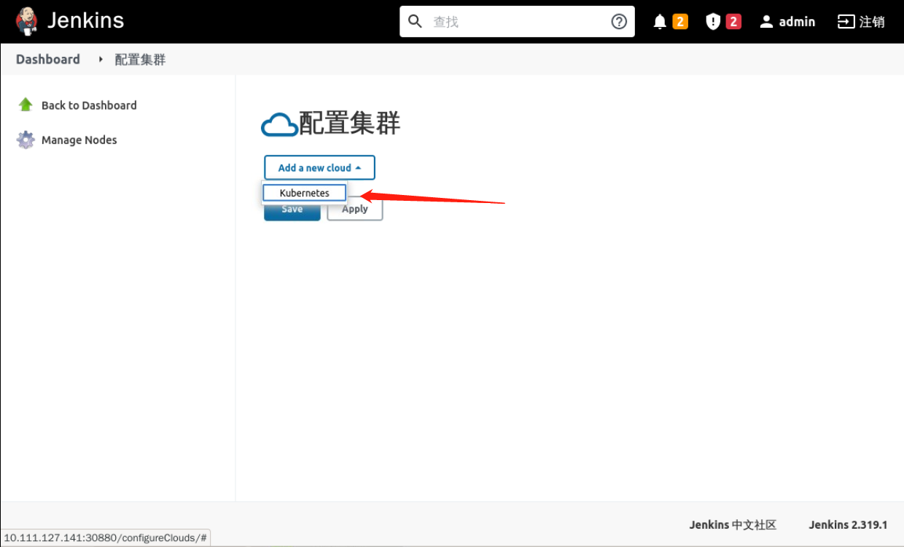

Then configure the Kubernetes address (internal address) and the namespace where the Slave will run, as follows

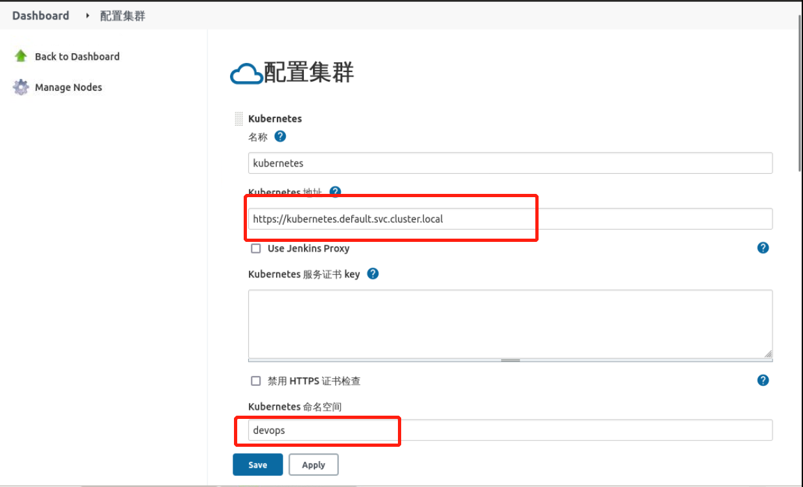

Click **Connection Test** to see the communication status between Jenkins and the Kubernetes cluster, when the result is `Connected to Kubernetes xxx` it means that the connectivity is normal, as follows:

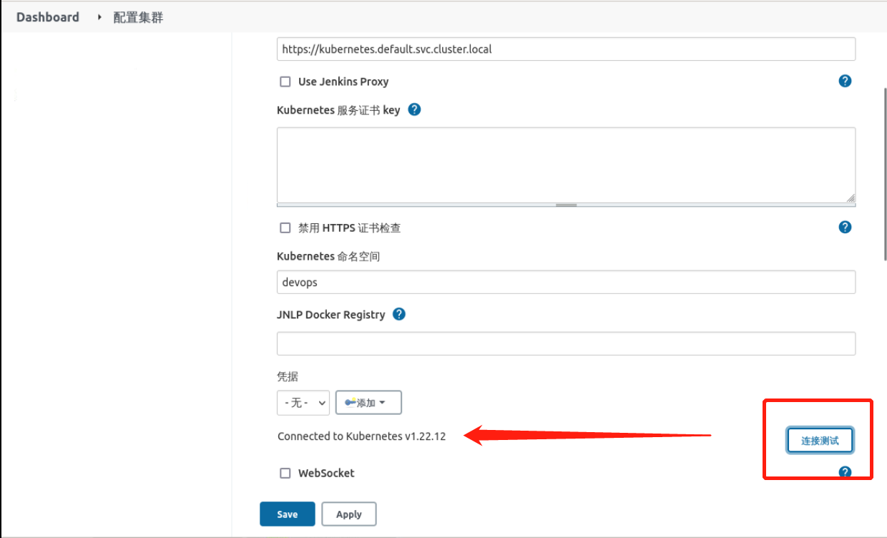

> PS: If the connection test fails, it's probably a permission issue, so we need to add the ServiceAccount credentials jenkins-sa to it.

To add the Jenkins address, just fill in the Service address, as follows:

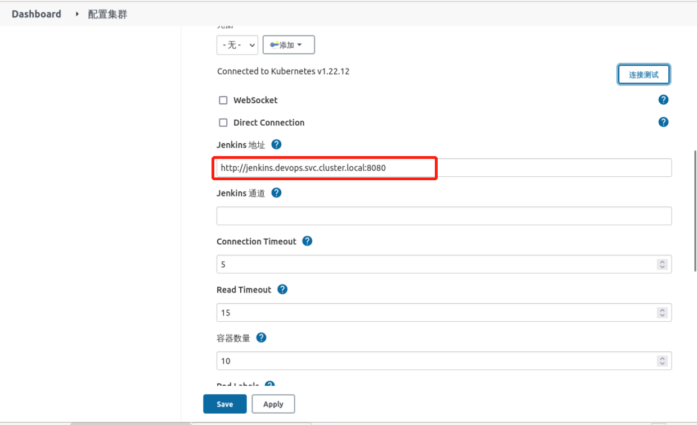

Select `Pod Templates` and add the Slave Pod template, as follows:

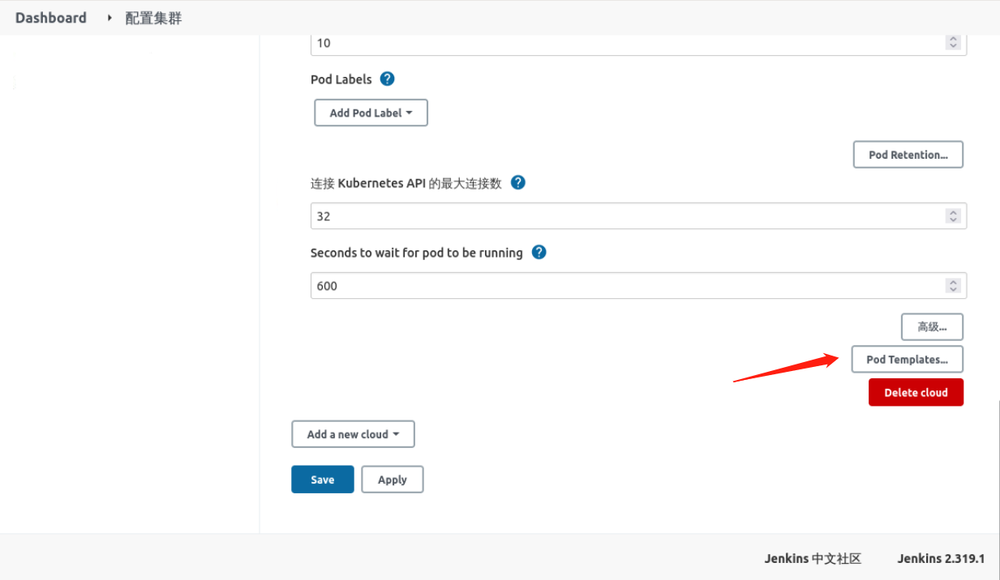

Select **Add Template** and configure as required, as follows:

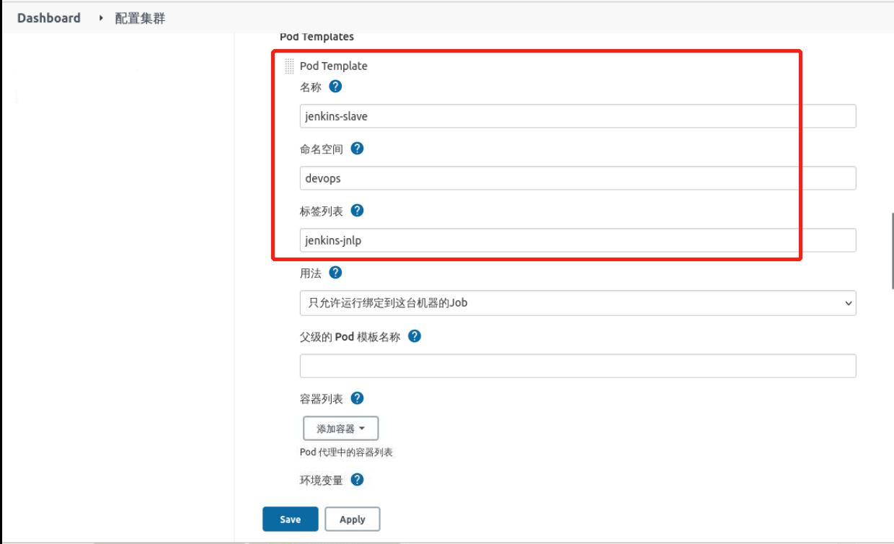

Add the container template, the image `registry.cn-hangzhou.aliyuncs.com/coolops/jenkins:jnlp6` contains the Jenkins Slave client, and also the docker and kubectl commands, as follows

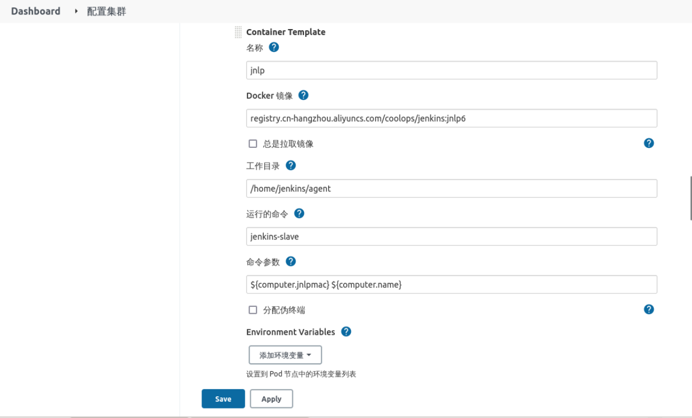

where:

- The run command is: `jenkins-slave`
- The command parameter is: `${computer.jnlpmac} ${computer.name}`

Two additional host directories need to be mounted:

1. `/var/run/docker.sock`: this file is used for the containers in the Pod to be able to share the Docker of the host;
1. `/home/shiyanlou/.kube`: this directory is mounted under the `/root/.kube` directory of the container. This is so that we can use the kubectl tool to access our Kubernetes cluster in the container of the Pod, so that we can deploy Kubernetes in the Slave Pod later applications;

As follows:

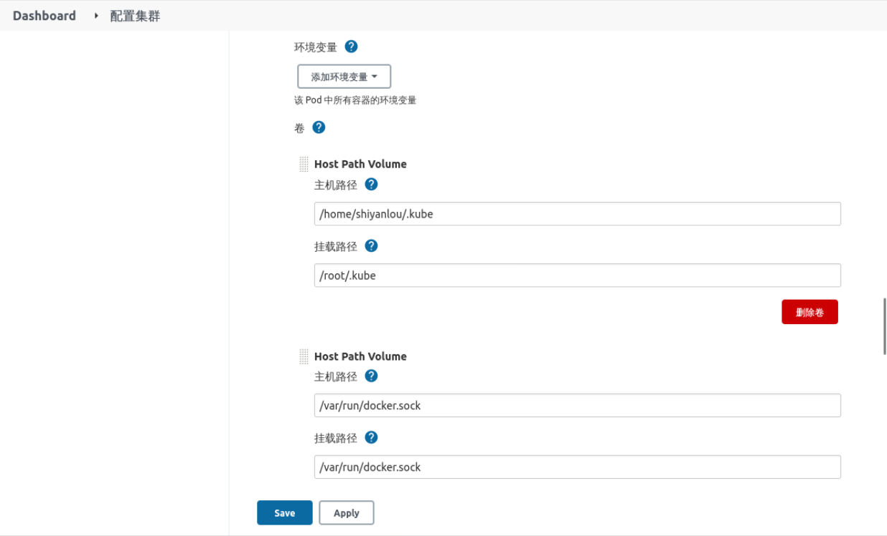

Finally, add `Service Account` to provide permissions to perform operations on Kubernetes, as follows:

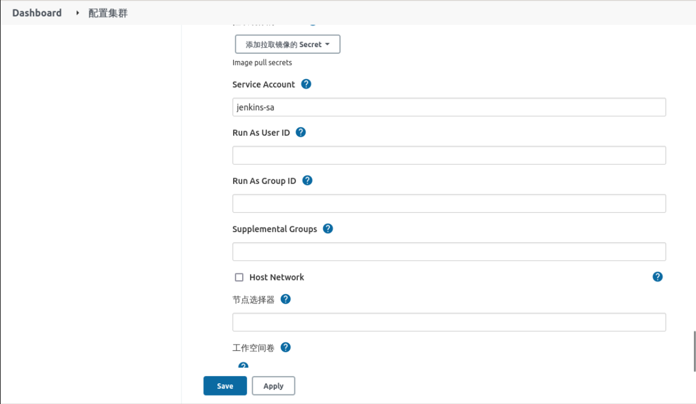

Click `Save` to complete the Kubernetes plug-in configuration.

#### Testing the Kubernetes plugin

Go back to Dashboard, select **New Task** and enter `test-kubernetes-slave`, as follows:

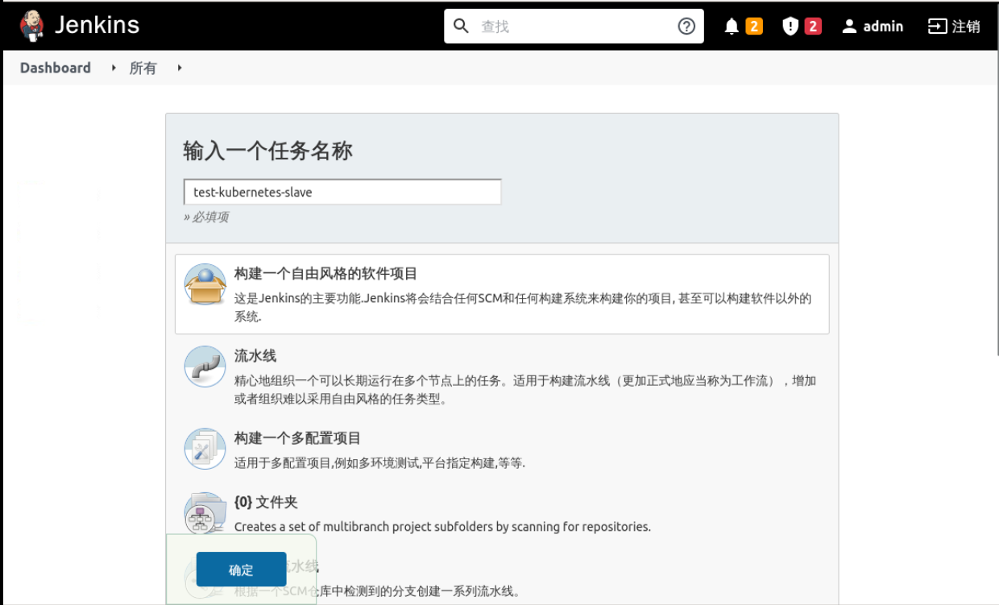

Select the node label, which is the Label configured in the Kubernetes plugin, as follows:

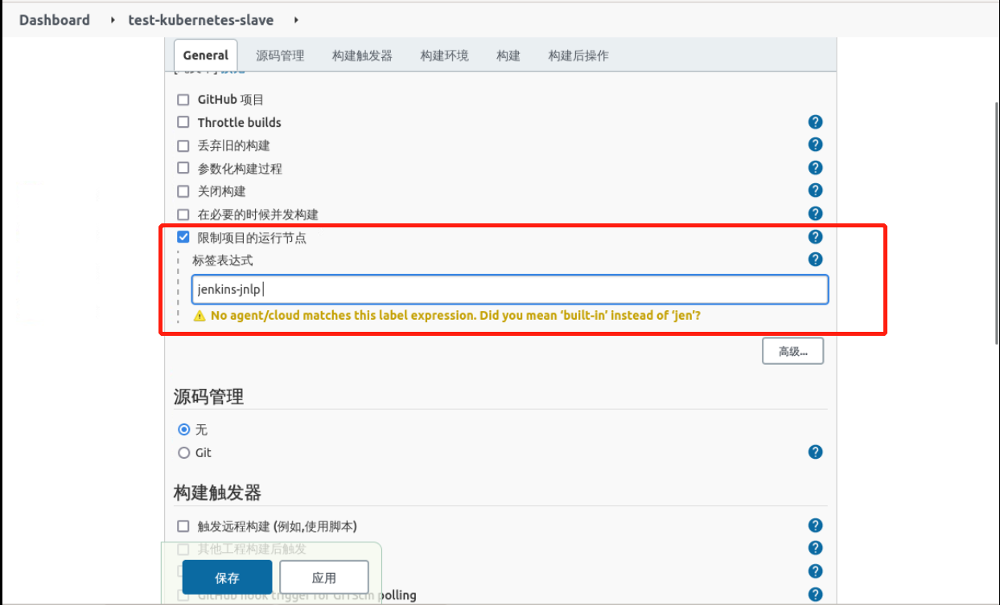

In the **Build** step, select **Execute Shell** and enter the following in the text:

```bash
echo "test docker command"
docker info

echo "------------"

echo "test kubectl command"
kubectl get pod
```

as follows:


Then click Save to complete the project configuration.

First open **Terminal** and type `kubectl get pod -n devops -w` to observe the Slave creation.

Click **Build Now** again, as follows:


Then in the terminal you can see the entire process of jenkins-slave from creation to deletion, as follows

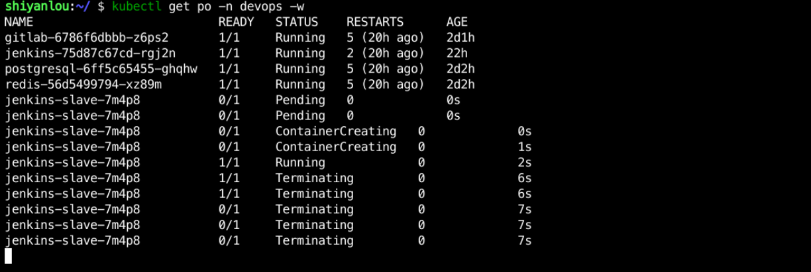

You can also see the build history in the jenkins panel, as follows

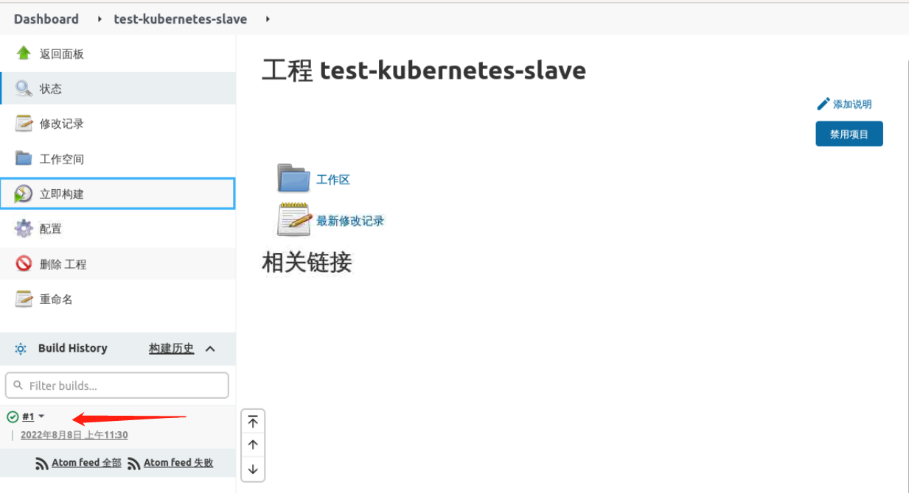

Click on a task in the build history and select **Console Output** to see the specific build log, as follows:


Now, we have finished configuring Kubernetes-based dynamic Slave generation.
