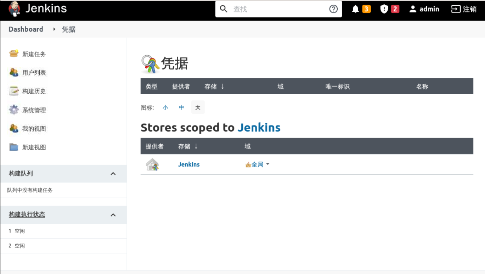
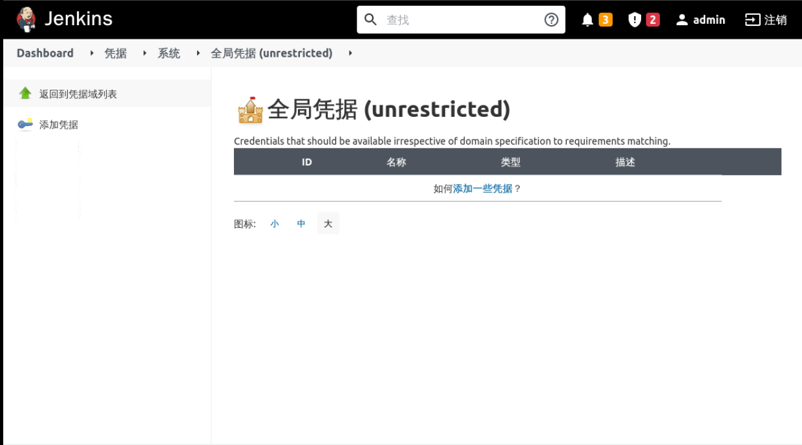
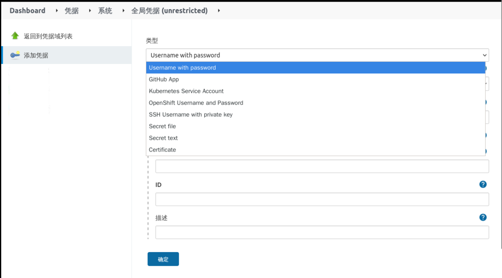

## Credential Management

Credential management is not very relevant to this experiment because it is relatively simple, but will be used later in the experiment, so I will briefly introduce it here.

Click **System Configuration** -> **Manege Credentials** to enter the credential management interface as follows:

Click **Global** above, then enter the global credentials configuration interface as follows:

Click **Add Credentials** to add different types of credentials, as follows:

Among the commonly used types are:

- Secret text - A token such as an API token (e.g. a GitHub personal access token).
- Username and password - either as separate fields or as a colon separated string: username:password.
- Secret file - The encrypted content stored in the file.
- Certificate - a PKCS#12 certificate file and an optional password

Let's take the example of adding credentials for Gitlab authentication by selecting `Username with password` and entering the username password and description as follows:

Clicking OK completes the creation of the credentials, which can be referenced later when you create the pipeline, which will be covered later in the experiment.
