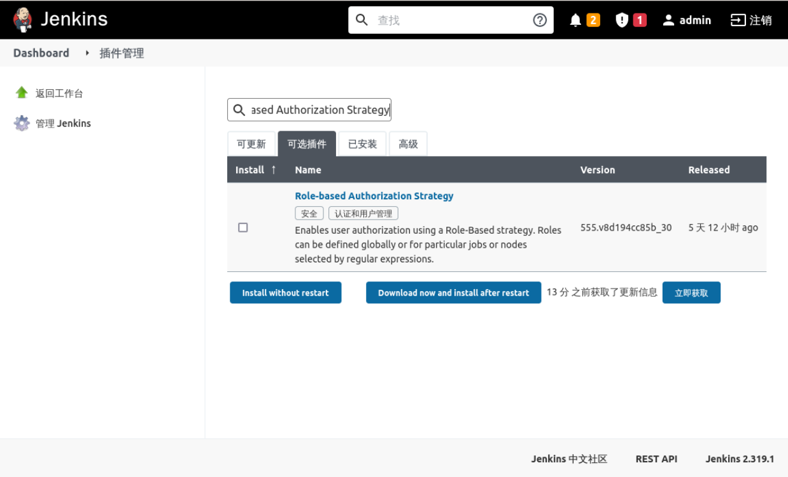

### Install plugins

We need to install the `Role-based Authorization Strategy` plugin and use it to complete the configuration of user role permissions.

Select **System Administration** -> **Plugin Management** -> **Optional Plugins**, search for `Role-based Authorization Strategy` and click Install, as follows:

When the installation is complete, select **Restart Jenkins**.
