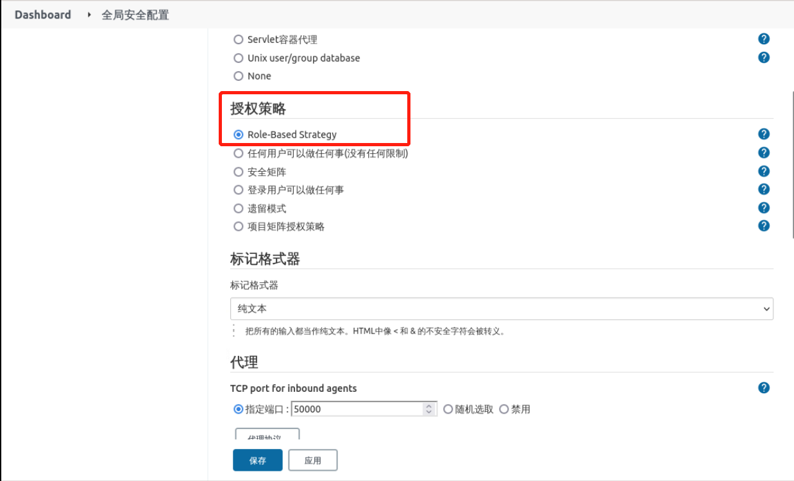

### Configure the authorization policy

Once the `Role-based Authorization Strategy` is installed, change the Jenkins default authorization policy if you want to use it.

Click **System Administration** -> **Global Security Configuration**, find **Authorization Strategy**, and select `Role-Based Strategy`, as follows:

Then click **Save** to complete the configuration.
