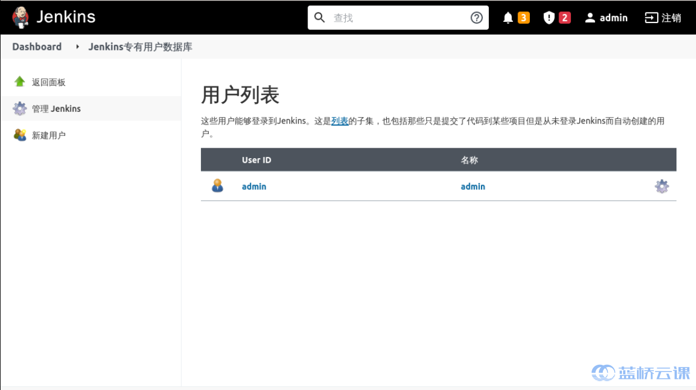
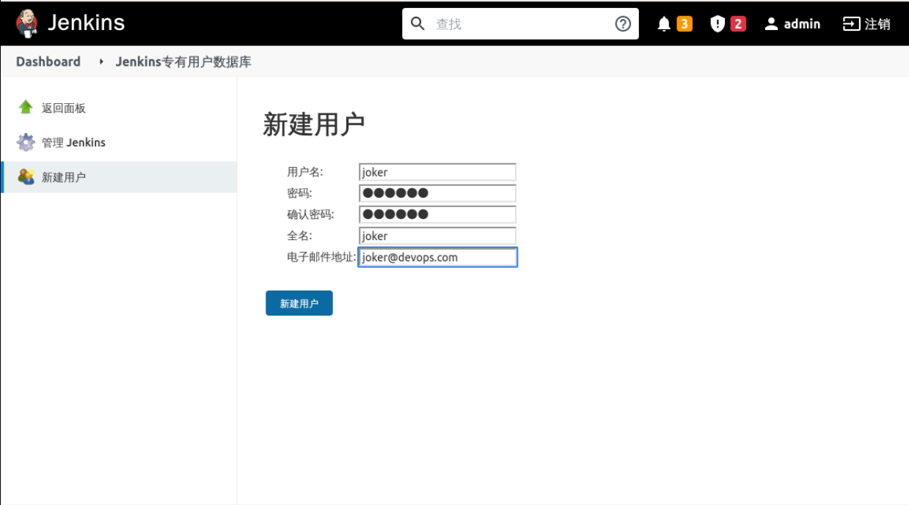
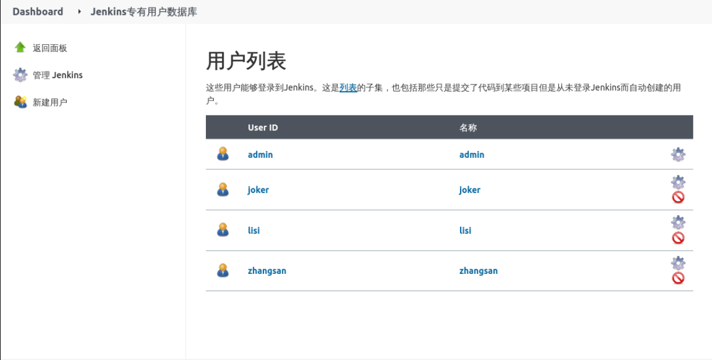

### Create users

Jenkins uses a built-in proprietary user database to store user information by default, but it is possible to integrate with external user systems such as LDAP, etc. For this experiment, we will use the default.

Click **System Administration** -> **Manage Users** to enter the user management interface, as follows:

Select **New User** to create `zhangsan`, `lisi`, and `joker` users, which are development, testing, and operation and maintenance respectively:

Click **New User** to complete the user creation, as follows:

If it is a user's deletion or update, it is operated in this page.
