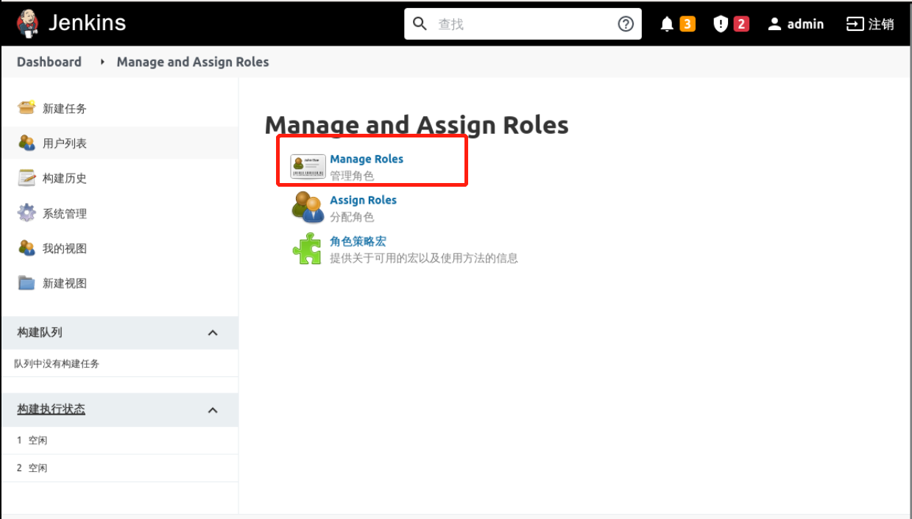
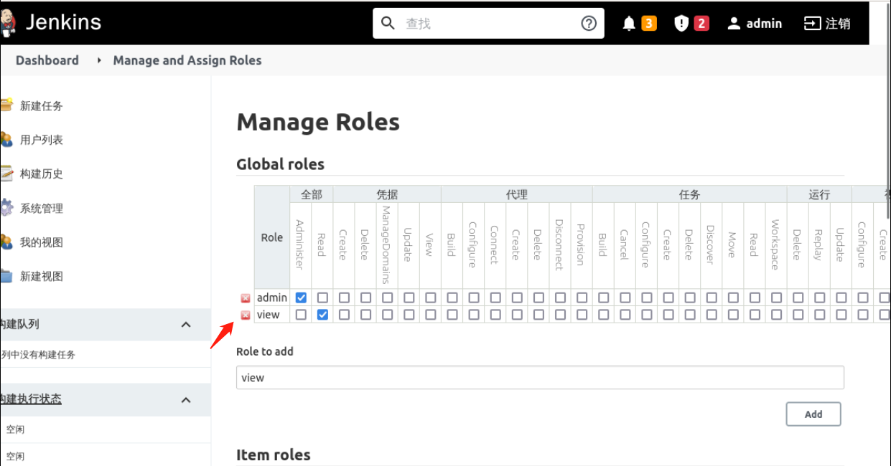
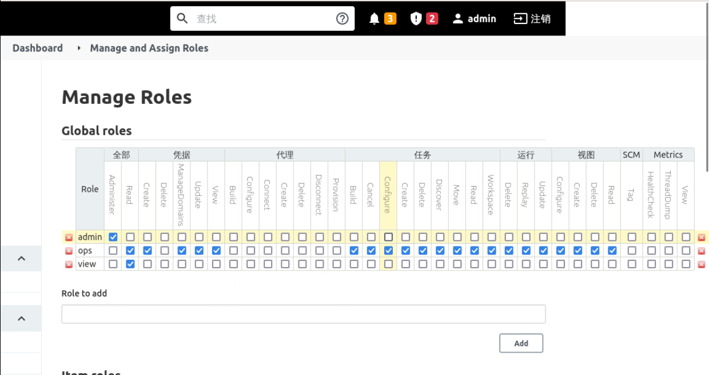

### Create role

`Manage And Assign Roles` provides three kinds of roles, which are:

- Global roles: Global roles, advanced users such as administrators can create global based roles
- Item roles: Project roles, roles for a particular item or items
- Node roles: Node roles, node-related permissions

We need to add a global role and give it read-only permissions, mainly to bind Jenkins users to the most basic access rights, otherwise it will report an error.

Click **System Configuration** -> **Manage And Assign Roles** and select `Manage Roles`, as follows:

Add the `View` role at `Global roles` and grant `Read` permissions as follows:

Add an `ops` role and grant global `Read` and `Create` permissions to it, as follows

Then create `dev` and `test` roles in `Item roles`, with `dev` matching items starting with `dev-.*` and `test` matches the item starting with `test-.*` for items starting with `test-:

Then click Save to complete the role configuration.
