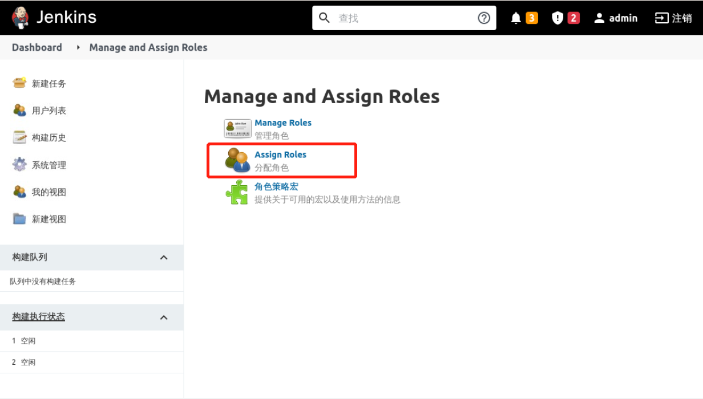
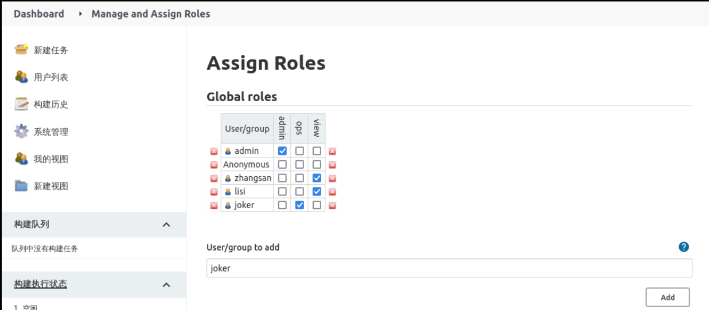
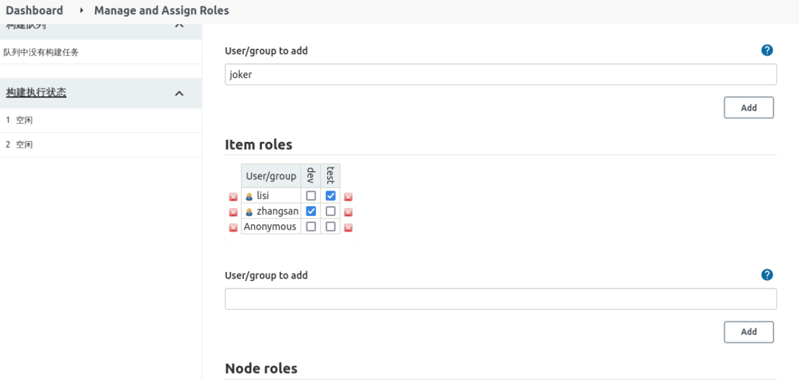

### User authorization

We have created `zhangsan`, `lisi` and `joker` users above, and their authorization rules are defined as follows:

- `zhangsan` grants the global `view` and project `dev` roles
- `lisi` grants the global `view` and project `test` roles
- `joker` grants the global `ops` role

Click **System Configuration** -> **Manage And Assign Roles** and select `Assign Roles`, as follows:

In `Global roles` add users and authorize them as follows:

Add users to `Item roles` and authorize them as follows:

Then click Save to complete the user authorization.
