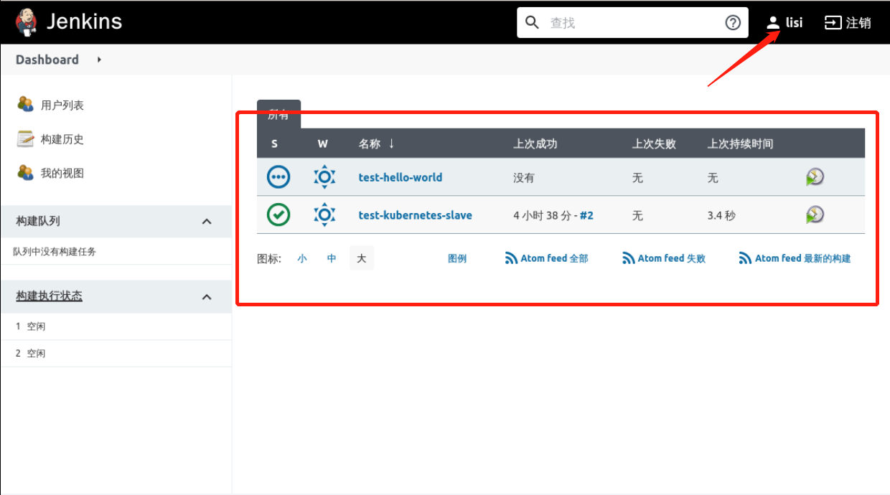
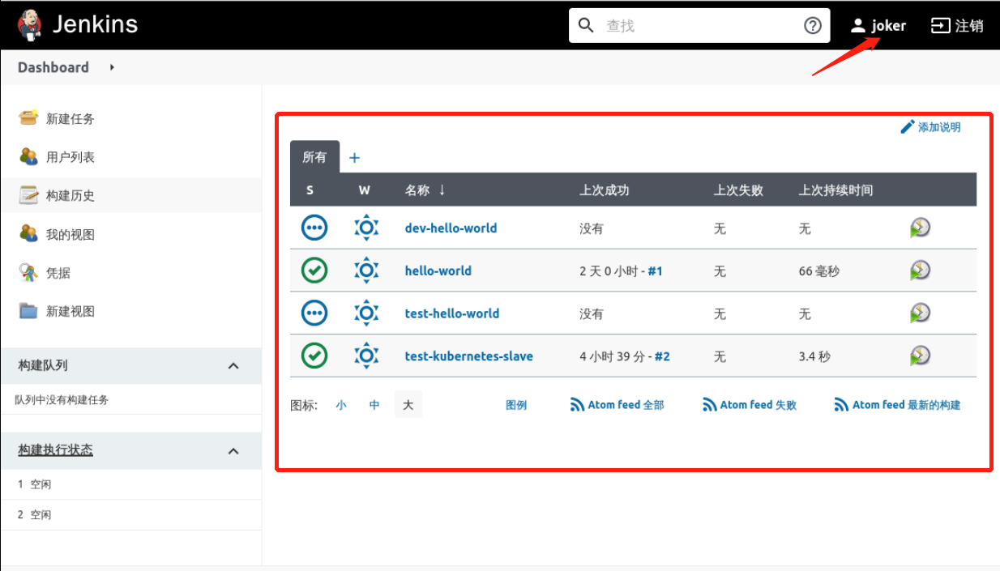

### Test user permissions

Create `dev-hello-world` and `test-hello-world` projects with the `admin` user as follows:

Logged in as `zhangsan`, only the projects starting with `dev-` are visible, as follows:

Logged in as `lisi`, only the items starting with `test-` are visible, as follows

Logged in as `joker` user, you can see all items as follows:

