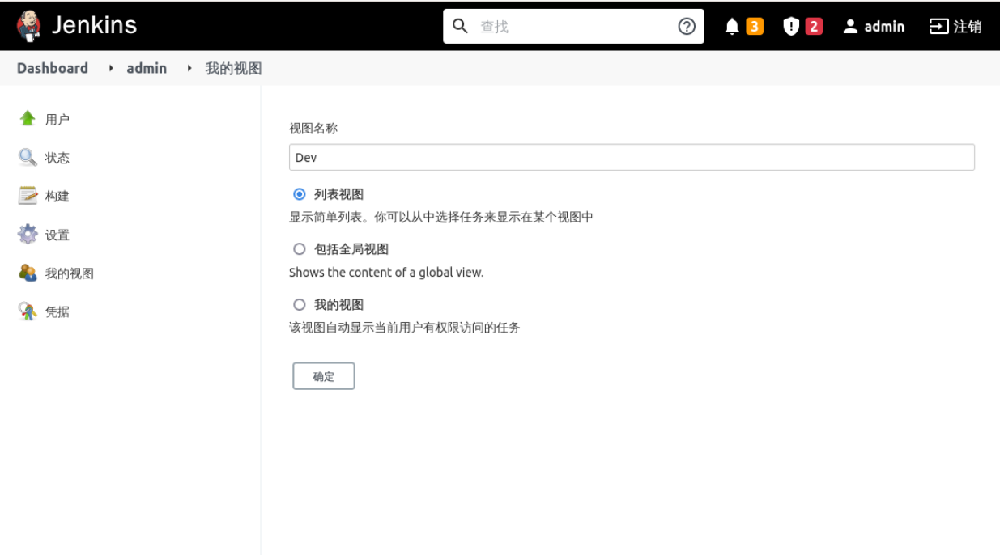
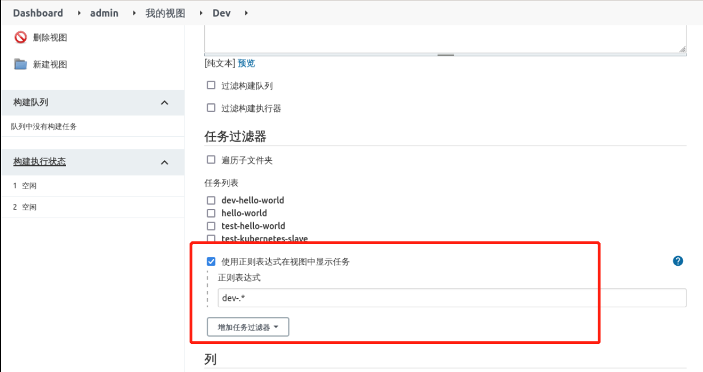
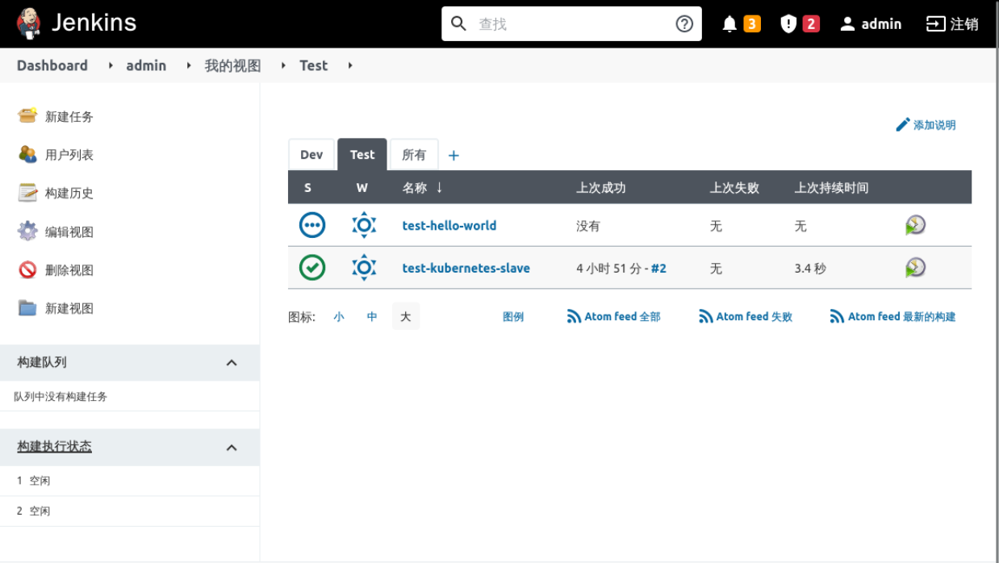

## Create a view

Now whether you log in as the `admin` or `joker` user, all the items you see are under the **all** view, as follows

This default view is fine when there are very few projects, but when there are a lot of projects, it can be very confusing and hard to distinguish them if they are not managed differently. You can distinguish by project group, you can distinguish by environment, etc. I use the environment distinction here, mainly to demonstrate this effect.

We define the view rules as follows:

- Dev view manages development environment projects, which all start with `dev-`.
- Test view manages the test environment items, which all start with `test-`.

Click on **My Views** -> **New View**, as follows:

Fill in **View Name** and select **List View**, as follows:

Select **Display tasks in view using regular expressions**, enter `dev-.*` expression, as follows:

and click Save.

Test The `Test` view is created in the same way as above, except that the regular expression is `test-.*`, which is not described here.

After it has been created, it looks like this:

- Click on the `Dev` view to display only the items starting with `dev-`, as follows:

- Click on the `Test` view to display only items starting with `test-`, as follows

