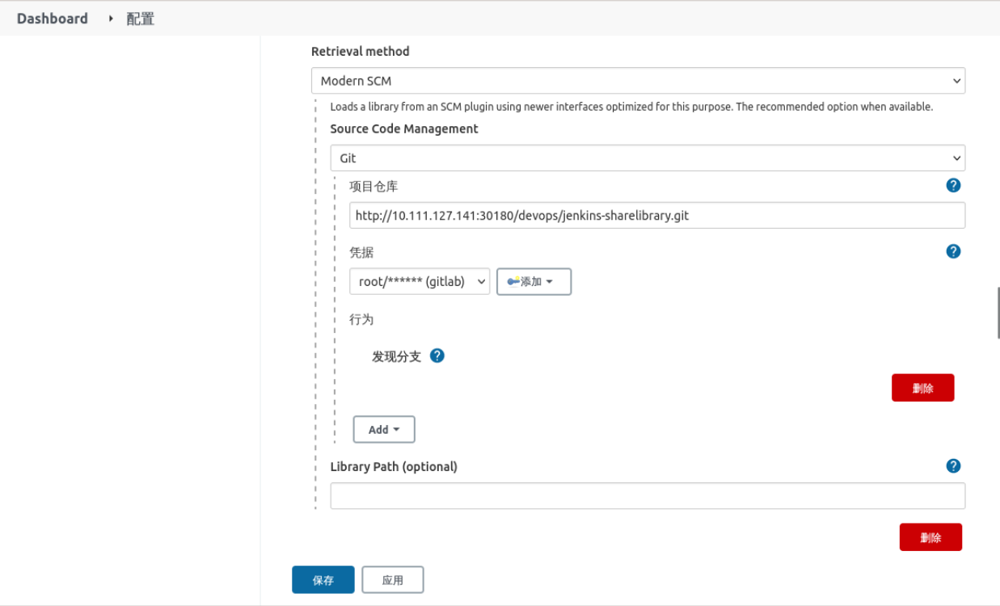

### Configuring shared libraries

#### Create a project

Create a project called `jenkins-sharelibrary` in the `devops` group of `Gitlab` as follows:


#### Add the file

Add the `src/org/devops/tools.groovy` file to the repository and enter the following:

```groovy
package org.devops

def printMsg(content){
    print(content)
}
```

as follows:


We have now completed the creation of the simple shared library.

#### Configuring Shared Libraries on Jenkins

On Jenkins, select **System Configuration** -> **System Configuration**, find `Global Pipeline Libraries`, and select **Add New**, as follows:


Configure the **repository name** and **branch** as follows:


Configure the shared repository Gitlab address as follows:



where the credentials are the ones we configured in the previous section.

Then click Save to complete the configuration.

#### Using Shared Libraries in Pipeline

To use a shared library, first introduce it in Pipeline as follows:

```groovy
// Configure the shared library, where 'sharedlibrary' is the name configured in Jenkins.
@Library('sharelibrary')
```

If you want to use the `printMsg` method in the shared library, you need to introduce it first and then use it, as follows:

```groovy
// Configure the shared library, where 'sharedlibrary' is the name configured in Jenkins.
@Library('sharelibrary')

// Introduce the methods in the shared library
def tools = new org.devops.tools()
```

Then you can call the methods using `tools.printMsg`.

Let's transform the Pipeline above as follows:

```groovy
// Configure the shared library, where 'sharelibrary' is the name configured in Jenkins.
@Library('sharelibrary')

// Introduce the methods in the shared library
def tools = new org.devops.tools()

pipeline{
    agent {
        label 'jenkins-jnlp'
    }
    stages{
        stage("GetCode"){
            steps{
                script{
                    tools.printMsg('Get Code')
                }
            }
        }

        stage("build"){
            steps{
                script{
                    tools.printMsg('Build Code')
                }
            }
        }

        stage("push"){
            steps{
                script{
                    tools.printMsg('Build Image')
                }
            }
        }

        stage("deploy"){
            steps{
                script{
                    tools.printMsg('Deploy APP')
                }
            }
        }
    }
}
```

Then replace the Pipeline code in the `dev-simple-pipeline` project, as follows


Run the test to see if the **shared library** works, as follows:


However, the output is now flat, so let's add some color to the output.

#### Install the `AnsiColor` plugin

Select **System Administration** -> **Plugin Management** and install the `AnsiColor` plug-in as follows:


After the installation is complete, restart Jenkins.

#### Modify the `tools.groovy` code in the `jenkins-sharelibrary`.

as follows:

```groovy
//formatting the output
def printMsg(value,colors){
    colors = ['red' : "\033[40;31m >>>>>>>>>>>${value}<<<<<<<<<<< \033[0m".
              'blue' : "\033[47;34m ${value} \033[0m".
              'green' : "\033[40;32m >>>>>>>>>>>${value}<<<<<<<<<<< \033[0m" ]
    ansiColor('xterm') {
        println(colors[color])
    }
}
```


The Pipeline code is then adapted as follows:

```groovy
// Configure the shared library, where 'sharelibrary' is the name configured in Jenkins.
@Library('sharelibrary')

// Introduce the methods in the shared library
def tools = new org.devops.tools()

pipeline{
    agent {
        label 'jenkins-jnlp'
    }
    stages{
        stage("GetCode"){
            steps{
                script{
                    tools.printMsg('Get Code','red')
                }
            }
        }

        stage("build"){
            steps{
                script{
                    tools.printMsg('Build Code','blue')
                }
            }
        }

        stage("push"){
            steps{
                script{
                    tools.printMsg('Build Image','green')
                }
            }
        }

        stage("deploy"){
            steps{
                script{
                    tools.printMsg('Deploy APP','green')
                }
            }
        }
    }
}
```

Then replace the Pipeline in the `dev-simple-pipeline` project and run the pipeline to see the effect, the following indicates that it works:


