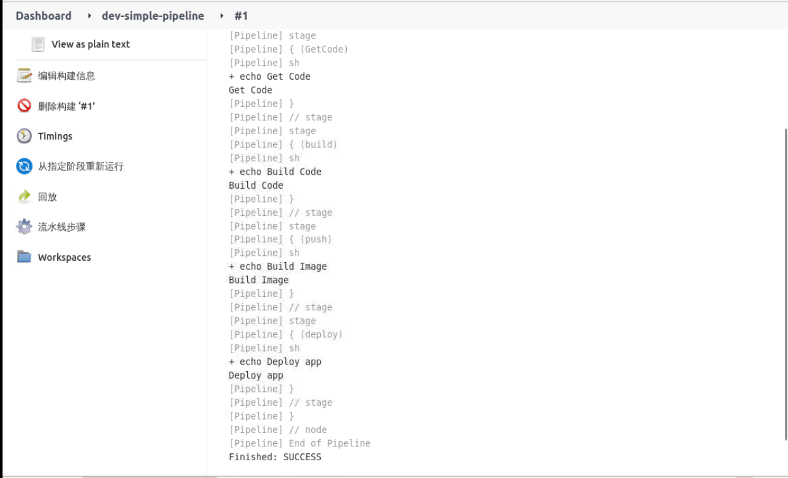

### Create a simple Pipeline

Select **New Task**, enter the task name, and select **Pipeline** as follows:


Then pull up to the **Pipeline** configuration and enter the following:

```groovy
pipeline{
    agent any
    stages{
        stage("GetCode"){
            steps{
                sh "echo 'Get Code' " //step
            }
        }

        stage("build"){
            steps{
                sh "echo 'Build Code' " //step
            }
        }

        stage("push"){
            steps{
                sh "echo 'Build Image' " //step
            }
        }

        stage("deploy"){
            steps{
                sh "echo 'Deploy app' " //step
            }
        }
    }
}
```

The results are as follows:


Then click **Save** and select **Build Now** in the project to see the build results, as follows:


In the **red box** you can see the exact steps and how long each step took.

At **build history** you can select the history ID to view the build log, the output is as follows:



To run it in the Jenkins Slave we configured earlier, i.e. using the dynamic Slave, simply change the script to the following:

```groovy
pipeline{
    agent {
        label 'jenkins-jnlp'
    }
    stages{
        stage("GetCode"){
            steps{
                sh "echo 'Get Code' " //step
            }
        }

        stage("build"){
            steps{
                sh "echo 'Build Code' " //step
            }
        }

        stage("push"){
            steps{
                sh "echo 'Build Image' " //step
            }
        }

        stage("deploy"){
            steps{
                sh "echo 'Deploy app' " //step
            }
        }
    }
}
```
