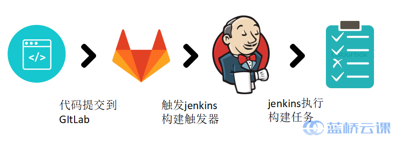

## Introduction to Experimentation

GitLab is a code repository for managing code, and Jenkins is an automation server that can run a variety of automated build, test, or deployment tasks. So, if you combine the two in a friendly way, this will make your team more productive.

Our goal for this experiment is to implement development to submit code to Gitlab and then automatically trigger the Jenkins pipeline to build and deploy it.

#### Knowledge Points

- gitlab webhook
- Generic Webhook Trigger
