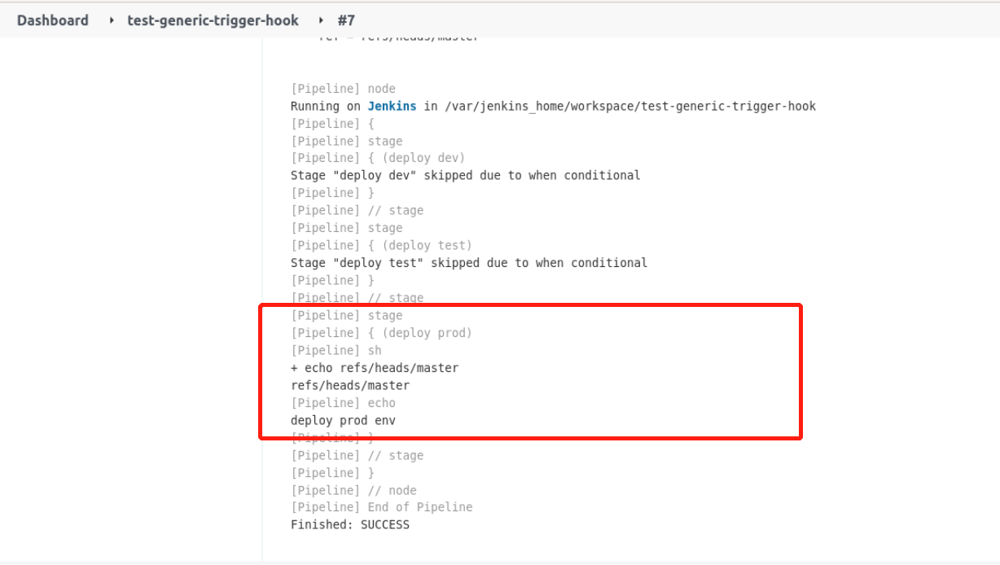

### Gitlab Webhook Configuration

Go to the project's `Settings` -> `Integrations` screen and add a new webhook, as follows:


url is the Jenkins trigger address, trigger events here we only check the Push events, do not need SSL authentication can be canceled.

Then click Test to see if the pipeline log is normal:


As you can see, we get the `ref` normally.

Now we can transform the pipeline into a multi-branch pattern as follows:

```groovy
pipeline {
  agent any
  triggers {
    GenericTrigger(
     genericVariables: [
      [key: 'ref', value: '$.ref']
     ].
     causeString: 'Triggered on $ref'.
     token: 'test-generic-trigger-hook-123'.
     printContributedVariables: true.
     printPostContent: true.
     silentResponse: false.
     regexpFilterText: '$ref'.
     regexpFilterExpression: 'refs/heads/(dev|test|master)'
    )
  }
  stages {
    stage('deploy dev') {
        when {
            expression { ref ==~ 'refs/heads/dev' }
        }
        steps {
            sh "echo $ref"
            print('deploy dev env')
        }
    }
    stage('deploy test') {
        when {
            expression { ref ==~ 'refs/heads/test' }
        }
        steps {
            sh "echo $ref"
            print('deploy test env')
        }
    }
    stage('deploy prod') {
        when {
            expression { ref ==~ 'refs/heads/master' }
        }
        steps {
            sh "echo $ref"
            print('deploy prod env')
        }
    }
  }
}
```

In the pipeline, we have added the `when` keyword to make conditional judgments. The `when` instruction allows the pipeline to determine whether the stage should be executed based on a given condition. The `when` instruction must contain at least one condition. If the `when` instruction contains multiple conditions, all subconditions must return `true` for the stage to be executed.

After the pipeline code is modified and you hit test again on Gitlab, the log output of the pipeline looks like this:



Since we only have the master branch in our code now, the pipeline is also triggered by the master when we test it, and the log above shows that only the master branch code executed the operation.
