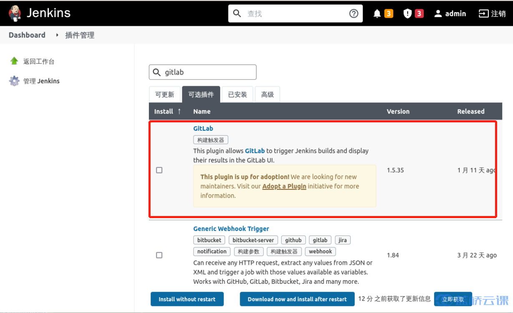

### Install the plugin

In Jenkins, select **System Configuration** -> **Plugin Management**, search for `Gitlab`, and select the plugin to install, as follows:

Restart Jenkins after installation.
