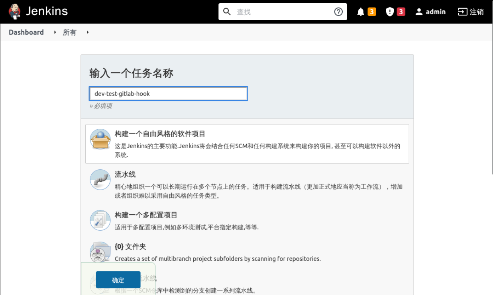
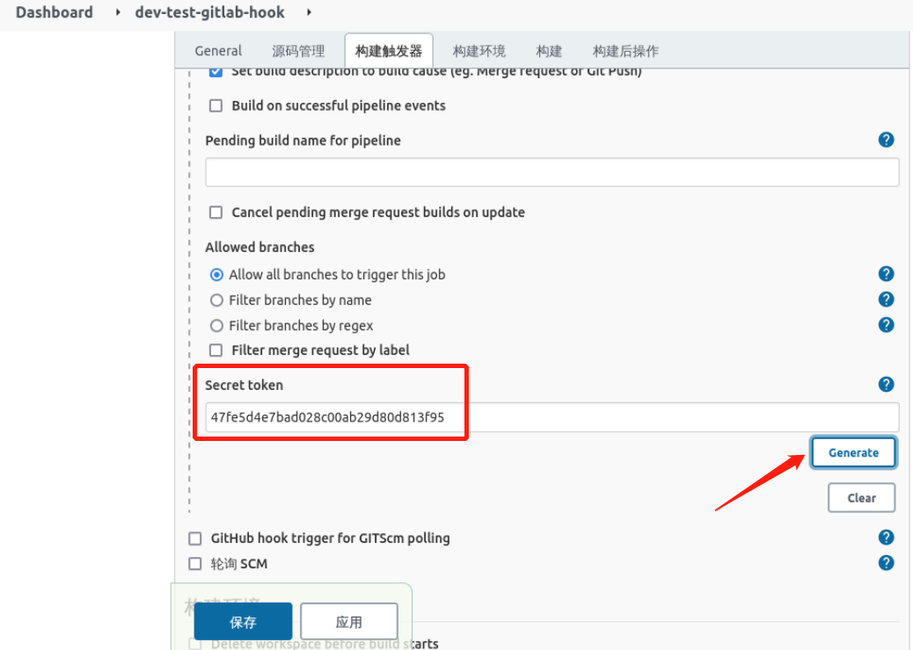
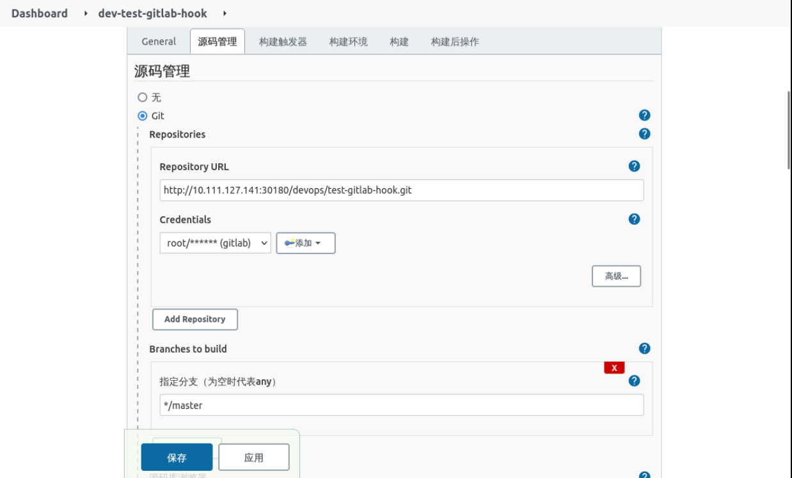

### Create and configure the project on Jenkins

Select **New Task**, enter a task name, and select **Free Style Project** as follows:



Then select `Build when a change is pushed to Gitlab` at the **Build Trigger** as follows:


where `Gitlab webhook URL` is the webhook address for the project.

For the rest of the configuration select the default, then select **Advanced** as follows:


Selecting `Generate` at `Secret token` will generate a Token, as follows:



Select `Build` -> `Execute shell` and enter the following:

```shell
echo "auto build"
```


Fill in the source code in **Source Code Manager** and configure it as follows:



After the configuration, save and exit.
