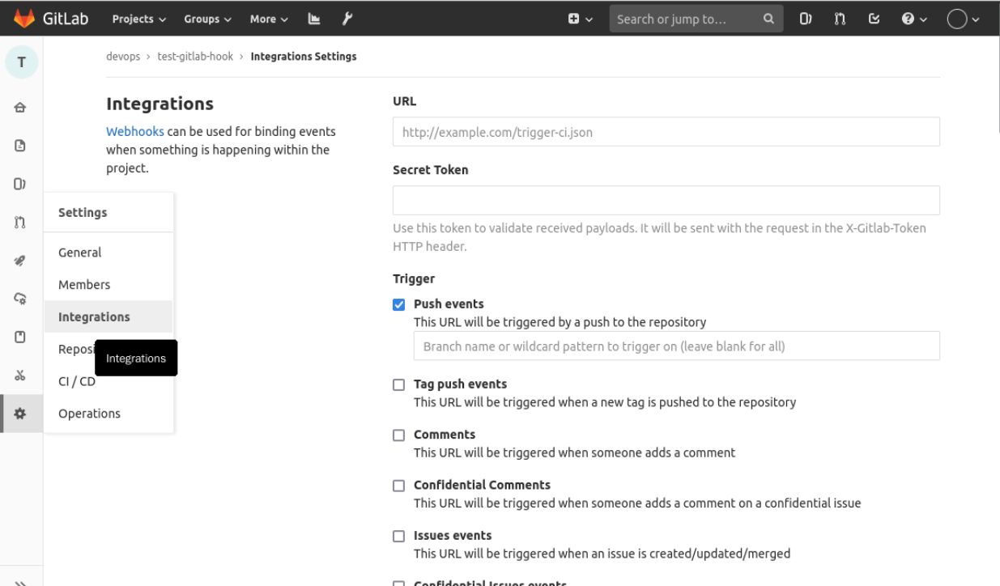
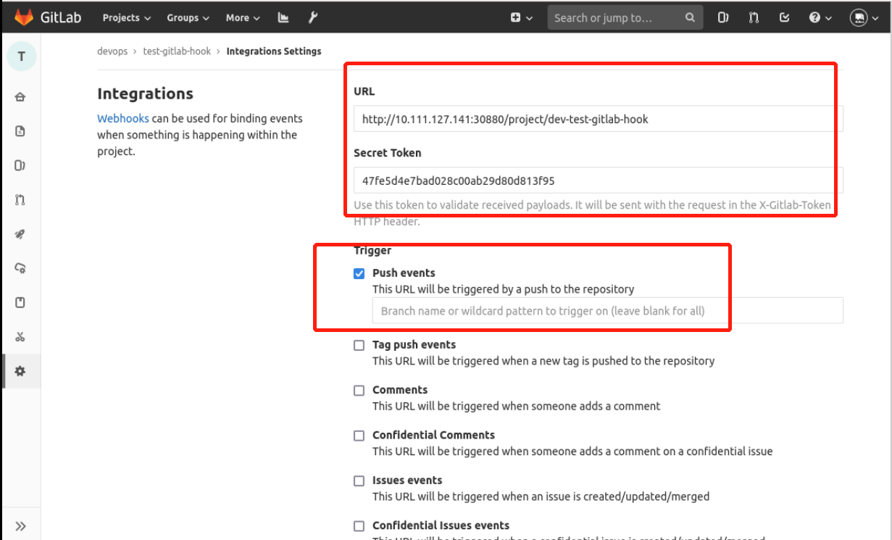
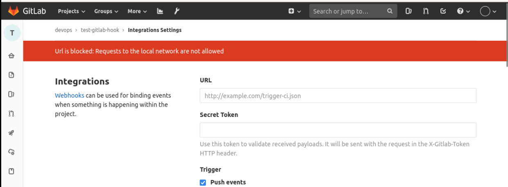
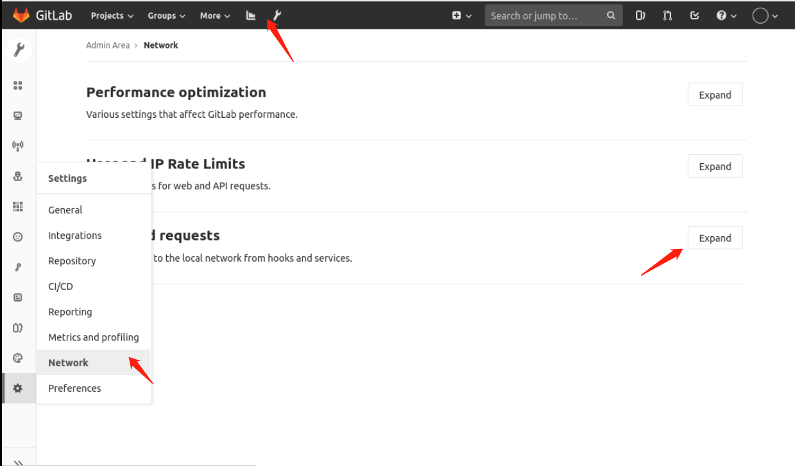
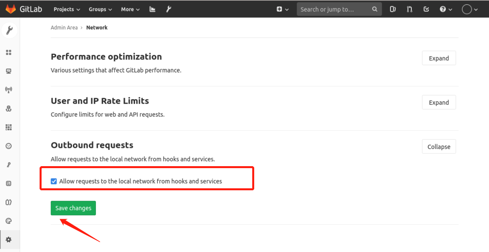

### Configuring Webhook on Gitlab

Find the `test-gitlab-hook` project, select `settings` -> `integrations`, and go to the following screen:

> PS: In the newer versions of Gitlab, it's called `webhooks`.

Then fill in the `webhook url` and `token` as follows:

where `Webhook url` and `token` are both found in the Jenkins project.

Pull them down, uncheck SSL and add them.

However, since Gitlab and Jenkins are on the same network, the default is to report an error with the following message:

Select **System Settings** -> **Network** -> **outbound requests** and choose to expand it as follows:

Then select **allow local network requests** and click save, as follows:

Now come back and add the Webhook without any problem, as follows to indicate successful addition.

We select `Test` -> `Push Events` to test if the Webhook is working properly, and see on Jenkins that the pipeline is triggered automatically, as follows:

Now the integration between Gitlab and Jenkins is complete.
