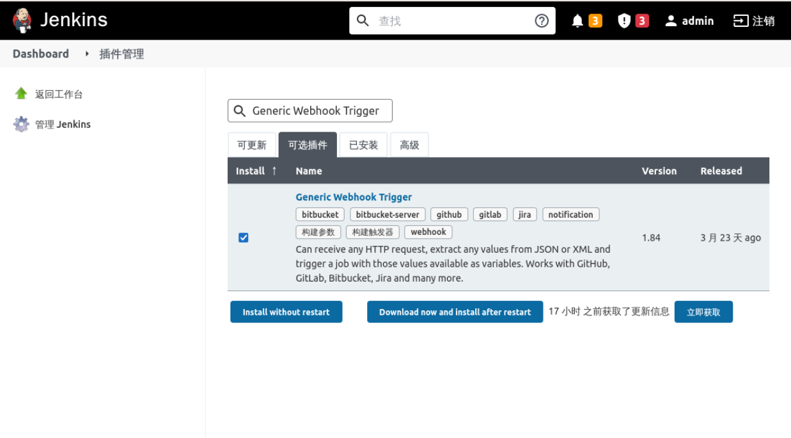
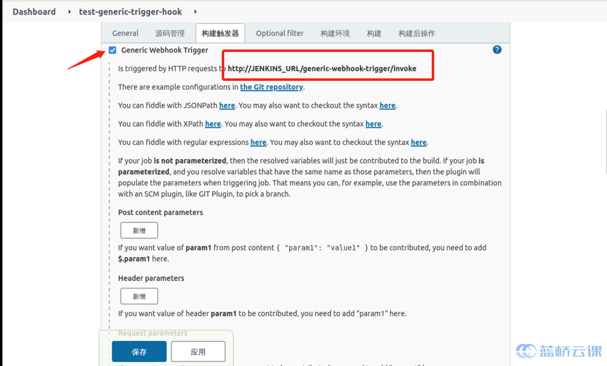

### Installing the Generic Webhook plugin

Select **System Configuration** -> **Plugin Management** on Jenkins, search for `Generic Webhook Trigger` at **Optional Plugins** and install it, as follows:

After the installation is complete, restart Jenkins.

After the plugin is installed, there will be an additional `Generic Webhook Trigger` on the task configuration page, as follows:

where `http://JENKINS_URL/generic-webhook-trigger/invoke` is a fixed format for triggering a Webhook, followed by a Token, e.g. `http://localhost:8080/generic-webhook-trigger /invoke?token=abc123`.
