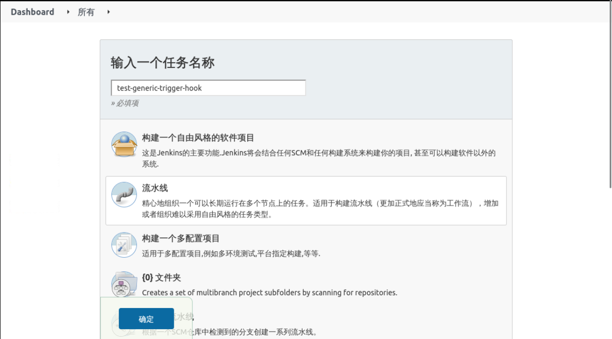
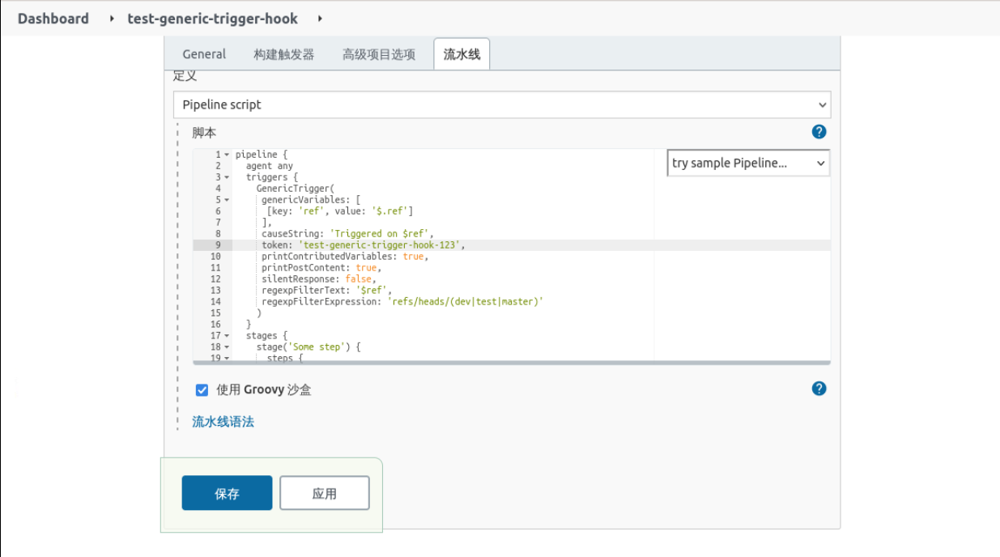

### Create a pipeline on Jenkins

Instead of creating a **free style pipeline**, we'll just use a Pipeline.

Select **New Task**, fill in the task name, and select **Pipeline** as follows:



Write the following at the **Pipeline** configuration

```groovy
pipeline {
  agent any
  triggers {
    GenericTrigger(
     genericVariables: [
      [key: 'ref', value: '$.ref']
     ].
     causeString: 'Triggered on $ref'.
     token: 'test-generic-trigger-hook-123'.
     printContributedVariables: true.
     printPostContent: true.
     silentResponse: false.
     regexpFilterText: '$ref'.
     regexpFilterExpression: 'refs/heads/(dev|test|master)'
    )
  }
  stages {
    stage('Some step') {
      steps {
        sh "echo $ref"
      }
    }
  }
}
```

Among them:

- token: is used to distinguish the trigger for different tasks, it is better to start with the application name when naming it, for example `test-generic-trigger-hook-123` here.
- genericVariables: get the values from JSONPath to assign to variables, for example, get `$.ref` to `ref` variable above. There is a lot more data than that, and when we turn on `printPostContent`, we can see more data in the log when the pipeline is executed, and get whatever data we need at that time.
- regexpFilterExpression: A regular expression that can be used to filter the required data, which is used to filter branches in our Pipeline above.
- regexpFilterText: This field is used in pairs with the above regexpFilterExpression, and the regular expression filters the content of this field.

After the configuration, click Save to exit.



Since we configured Generic via Pipeline, we need to manually execute a build to actually configure it, here is the configuration after the manual execution


